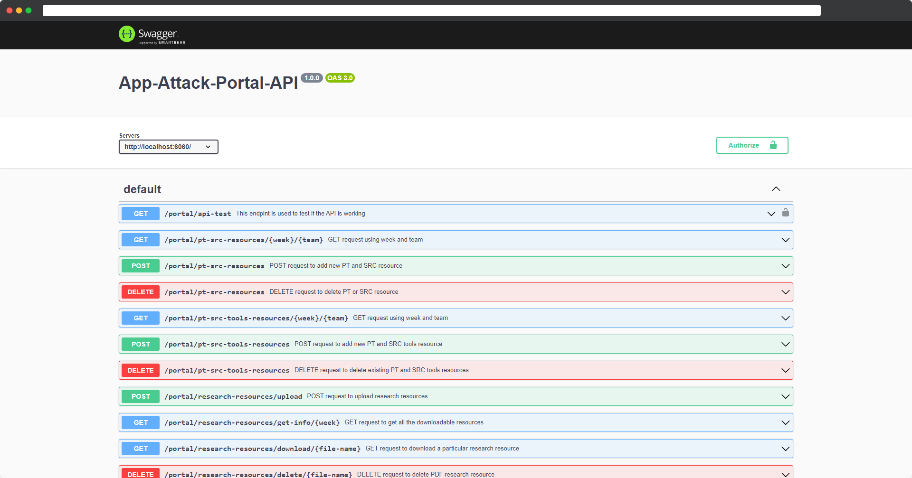
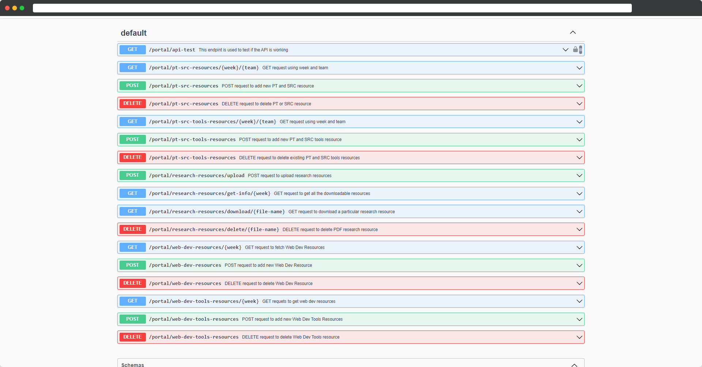
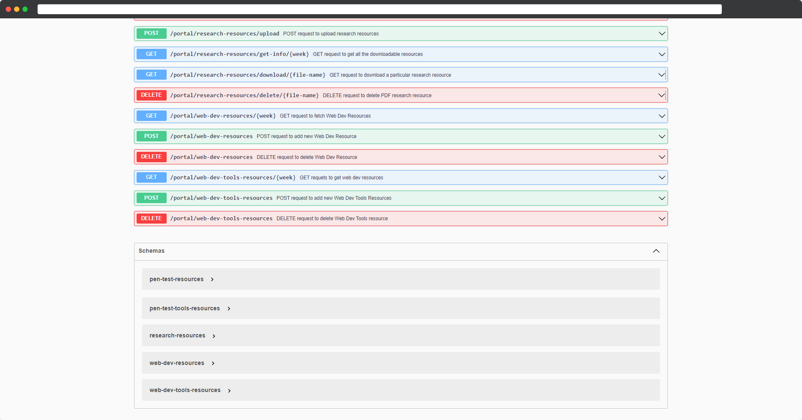
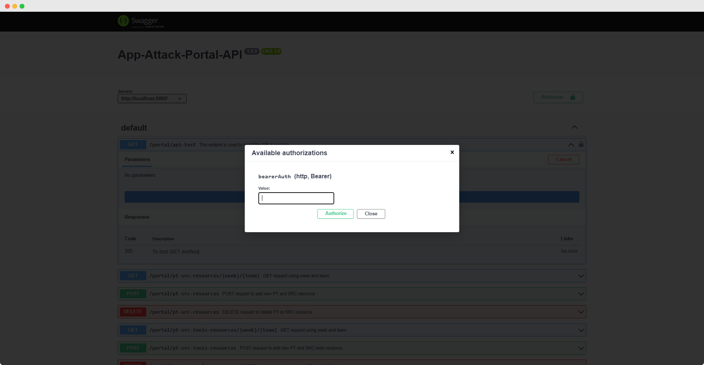
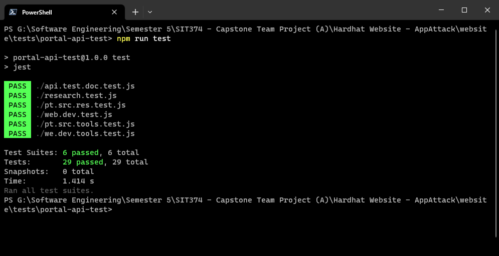

# Hardhat Portal API
Welcome to the documentation for our Portal API, where you'll find comprehensive information about its features, setup, and usage. 

## Features

- PT (Penetration Testing) and SRC (Secure Code Review) Resources
  - Resources:
    - Fetch PT and SRC Resources by week and team.
    - Create PT and SRC Resources by week and team.
    - Delete PT and SRC Resources by week and team.
  - Tools:
    - Fetch PT and SRC Tools Resources by week and team.
    - Create PT and SRC Tools Resources by week and team.
    - Delete PT and SRC Tools Resources by week and team.
- Research Resources:
  - Fecth infomation about existing PDF resources on the server.
  - Downloading existing PDF from the server.
  - Uploading research related PDF's to the server.
  - Deleting existing resources form the server. 
- Web Development Resources
  - Resources:
    - Fetch Web Development Resources by week.
    - Create Web Development Resources by week.
    - Delete Web Development Resources by week.
  - Tools Resources
    - Fetch Web Development Tools Resources by week.
    - Create Web Development Tools Resources by week.
    - Delete Web Development Tools Resources by week.
- Route Authentication: API routes can be authenticated using JWT.
  - Authentication is not enabled by default, needs to be enabled manually.

## Run Locally

Clone the project

```bash
  git clone https://github.com/Hardhat-AppAttack/website.git
```

Go to the project directory

```bash
  cd /website/apis/portal-api
```

Install dependencies

```bash
  npm install
```

Start the server

```bash
  npm start
```

## Screenshots

### Swagger API Documentation

**Local swagger socumentation link:** http://localhost:6060/portal/api-docs/





## API Reference

### Detailed Documentation

#### Get API docs

```http
  GET /portal/api-docs
```
### API Test

#### Test API for working

```http
  GET /portal/api-test
```

###### Response Body

```json
The API is working!
```

### PT (Penetration-Testing) and SRC (Secure Code Review)

#### GET PT or SRC resource

```http
  GET /portal/pt-src-resources/${week}/${team}
```

| Parameter | Type     | Description                       |
| :-------- | :------- | :-------------------------------- |
| `week`      | `integer` | **Required**. Week number |
| `team`      | `string` | **Required**. Team Name [PT, SRC] |

###### Response Body JSON Format
```json
[
  {
    "name": "string",
    "week": 0,
    "description": "string",
    "team": "PT",
    "time_taken_to_complete": "string",
    "url": "string",
    "created": "date"
  }
]
```

#### POST request to create new PT or SRC resource

```http
  POST /portal/pt-src-resources/
```

###### Request Body JSON Format

```json
{
  "name": "string",
  "week": number,
  "team": "string",
  "description": "string",
  "time_taken_to_complete": "string",
  "url": "string"
}
```

#### DELETE request to delete existing PT or SRC resource

```http
  DELETE /portal/pt-src-resources/
```

###### Request Body JSON Format

```json
{
  "name": "string",
  "week": number,
  "team": "string"
}
```

#### GET PT or SRC tools resource

```http
  GET /portal/pt-src-tools-resources/${week}/${team}
```

| Parameter | Type     | Description                       |
| :-------- | :------- | :-------------------------------- |
| `week`      | `integer` | **Required**. Week number |
| `team`      | `string` | **Required**. Team Name [PT, SRC] |

###### Response Body JSON Format

```json
[
  {
    "name": "string",
    "created": "date",
    "week": 0,
    "team": "PT",
    "os": "windows",
    "description": "string",
    "url": "string"
  }
]
```
#### POST request to create new PT or SRC tools resource

```http
  POST /portal/pt-src-tools-resources/
```

###### Request Body JSON Format

```json
{
  "name": "string",
  "week": 0,
  "team": "PT",
  "os": "windows",
  "description": "string",
  "url": "string"
}
```
#### DELETE request to delete existing PT or SRC tools resource

```http
  DELETE /portal/pt-src-tools-resources/
```

###### Request Body JSON Format

```json
{
  "name": "string",
  "week": number,
  "team": "string"
}
```

## Research Resource

#### GET Research resource info

```http
  GET /portal/research-resources/get-info/${week}
```

| Parameter | Type     | Description                       |
| :-------- | :------- | :-------------------------------- |
| `week`      | `integer` | **Required**. Week number |

###### Response Body Format
```json
[
  {
    "name": "string",
    "week": 0,
    "description": "string",
    "time_taken_to_complete": "string",
    "url": "string",
    "created": "date"
  }
]
```

#### Download Research resource pdf

```http
  GET /portal/research-resources/doanload/${url}
```

| Parameter | Type     | Description                       |
| :-------- | :------- | :-------------------------------- |
| `url`      | `string` | **Required**. Name of the file |


#### POST request to upload new Research resource

```http
  POST /portal/pt-src-tools-resources/upload
```

#### DELETE request to delete existing Research resource

```http
  DELETE /portal/pt-src-tools-resources/delete/${url}
```

| Parameter | Type     | Description                       |
| :-------- | :------- | :-------------------------------- |
| `url`      | `string` | **Required**. Name of the file |

## Web Development Resources

#### GET Web Dev resource

```http
  GET /portal/web-dev-resources/${week}
```

| Parameter | Type     | Description                       |
| :-------- | :------- | :-------------------------------- |
| `week`      | `integer` | **Required**. Week number |

###### Response Body JSON Format
```json
[
    {
        "name": "string",
        "week": 0,
        "tutorial_type": "string",
        "description": "string",
        "time_taken_to_complete": "string",
        "url": "string",
        "created": "date"
    }
]
```

#### POST request to create new Web Dev resource

```http
  POST /portal/web-dev-resources/
```

###### Request Body JSON Format

```json
{
  "name": "string",
  "week": 0,
  "tutorial_type": "string",
  "description": "string",
  "time_taken_to_complete": "string",
  "url": "string"
}
```

#### DELETE request to delete existing Web Dev resource

```http
  DELETE /portal/web-dev-resources/
```

###### Request Body JSON Format

```json
{
  "name": "string",
  "week": number
}
```

#### GET Web Dev resource

```http
  GET /portal/web-dev-tools-resources/${week}
```

| Parameter | Type     | Description                       |
| :-------- | :------- | :-------------------------------- |
| `week`      | `integer` | **Required**. Week number |

###### Response Body JSON Format
```json
[
    {
        "name": "string",
        "week": 0,
        "description": "string",
        "url": "string",
        "created": "date"
    }
]
```

#### POST request to create new Web Dev resource

```http
  POST /portal/web-dev-tools-resources/
```

###### Request Body JSON Format

```json
{
  "name": "string",
  "week": 0,
  "description": "string",
  "url": "string"
}
```

#### DELETE request to delete existing Web Dev resource

```http
  DELETE /portal/web-devtools-resources/
```

###### Request Body JSON Format

```json
{
  "name": "string",
  "week": number
}
```

## Environment Variables

To run this project, you will need to add the following environment variables to your .env file

`SECRET`: very secret value/ should be same as the value used in the backend of the web app"

## Documentation

### Enabling Authentication on API Routes

###### Before Changes
```javascript
app.get('/portal/api-test', (req, res) => {
    res.send('The API is working!');
});
```
###### After Changes
```javascript
app.get('/portal/api-test', authenticateToken,(req, res) => {
    res.send('The API is working!');
});
```

### Enable Authentication Globally
Uncomment this line
```javascript
app.use(authenticateToken); // To enable authentication on all the routes 
```

### Enabling Authentication on Swagger API Documentation

###### Before making changes
```javascript
/**
 * @swagger
 * /portal/api-test:
 *  get:
 *      summary: This endpint is used to test if the API is working
 *      responses:
 *          200:
 *              description: To test GET method
 */
app.get('/portal/api-test', (req, res) => {
    res.send('The API is working!');
});
```
After making changes
```javascript
/**
 * @swagger
 * /portal/api-test:
 *  get:
 *      summary: This endpint is used to test if the API is working
 *      security:
 *          - bearerAuth: []
 *      responses:
 *          200:
 *              description: To test GET method
 */
app.get('/portal/api-test', (req, res) => {
    res.send('The API is working!');
});
```
**Screenshot of the authentication working on Swagger**




### Running Tests

To run tests, run the following command

Go to the project test directory
```bash
  cd /website/test/portal-api-test
```

Run Test
```bash
  npm run test
```

##### All JEST tests running sucessfully



## Deployment

[Deployment](./deployment.md)

## Authors

- [@xOscarCodes](https://github.com/xOscarCodes)

